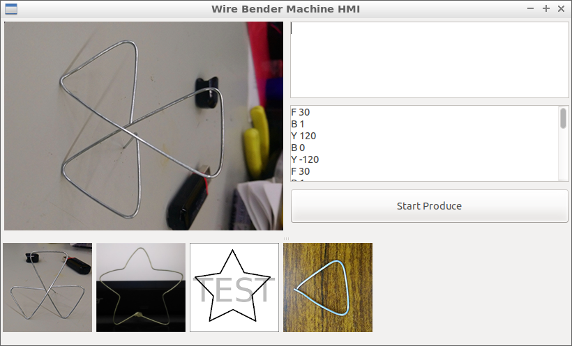
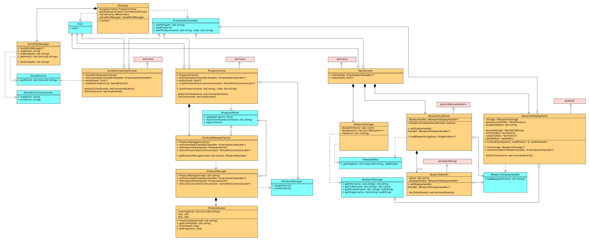

Wire Bender HMI
===



This is the HMI (Human Machine Interface) of the Wire Bender project.

### Required dependents

- wxWidget 3.0
- [wjwwood/serial](https://github.com/wjwwood/serial)

### UML




 ### Compile

```bash
cd src
cmake ..
make
```

### Bending Code

You can see the folder `blueprint` in the build folder,

and there are `wbcode.wbcode` in the `test` folder which is default blueprint, do not delete it,

wbcode follow the rule under below:

`F 10` : feeding wire 10 mm

`Y 40` : Rotate y-axis for 40 degree.

`Z 40` : Rotate z-axis for 40 degree.

`B 1` : Slide bender out 

`B 0` : Slide bender in